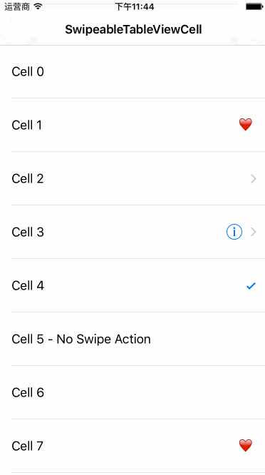

#SwipeableTableViewCell
SwipeableTableViewCell is a quite easy-to-use UITableViewCell subclass which allows you to add multiple highly customizable swipe actions.



##How To Get Started
###Carthage
Specify "SwipeableTableViewCell" in your Cartfile:
```ogdl 
github "teambition/SwipeableTableViewCell"
```

###Usage
##### 1. TableViewController
Import "SwipeableTableViewCell":
```swift
import SwipeableTableViewCell
```
Configure cell in the data source like this:
```swift
override func tableView(tableView: UITableView, cellForRowAtIndexPath indexPath: NSIndexPath) -> UITableViewCell {
    var cell = tableView.dequeueReusableCellWithIdentifier("Cell") as? SwipeableTableViewCell
    if cell == nil {
        cell = SwipeableTableViewCell(style: .Default, reuseIdentifier: "Cell")
    }

    // assign delegate if needed
    cell!.delegate = self

    // configure cell swipe actions
    let deleteTitle = NSAttributedString(string: "删除", attributes: [NSForegroundColorAttributeName: UIColor.whiteColor(), NSFontAttributeName: UIFont.systemFontOfSize(15)])
    var deleteAction = SwipeableCellAction(title: deleteTitle, image: UIImage(named: "delete-icon"), backgroundColor: UIColor.redColor()) { Void in
        // do something when "deleteAction" is selected
    }
    let laterTitle = NSAttributedString(string: "稍后处理", attributes: [NSForegroundColorAttributeName: UIColor.whiteColor(), NSFontAttributeName: UIFont.systemFontOfSize(15)])
    var laterAction = SwipeableCellAction(title: laterTitle, image: UIImage(named: "later-icon"), backgroundColor: UIColor.blueColor()) { Void in
        // do something when "laterAction" is selected
    }
    deleteAction.width = 100
    deleteAction.verticalSpace = 6
    laterAction.width = 100
    laterAction.verticalSpace = 6
    cell!.actions = [deleteAction, laterAction]

    // other configurations
    cell!.textLabel?.text = "Cell"

    return cell!
}
```

##### 2.  Implement delegate if needed
```swift
func swipeableCell(cell: SwipeableTableViewCell, scrollingToState state: SwipeableCellState) {
    // do something
}

func swipeableCellSwipeEnabled(cell: SwipeableTableViewCell) -> Bool {
    // cell swipe enabled or not, default value is true
}

func allowMultipleCellsSwipedSimultaneously() -> Bool {
    // allow multiple cells swiped simultaneously or not, default value is false
}

func swipeableCellDidEndScroll(cell: SwipeableTableViewCell) {
    // do something
}
```

## Minimum Requirement
iOS 8.0

## Release Notes
* [Release Notes](https://github.com/teambition/SwipeableTableViewCell/releases)

## License
SwipeableTableViewCell is released under the MIT license. See [LICENSE](https://github.com/teambition/SwipeableTableViewCell/blob/master/LICENSE.md) for details.

## More Info
Have a question? Please [open an issue](https://github.com/teambition/SwipeableTableViewCell/issues/new)!